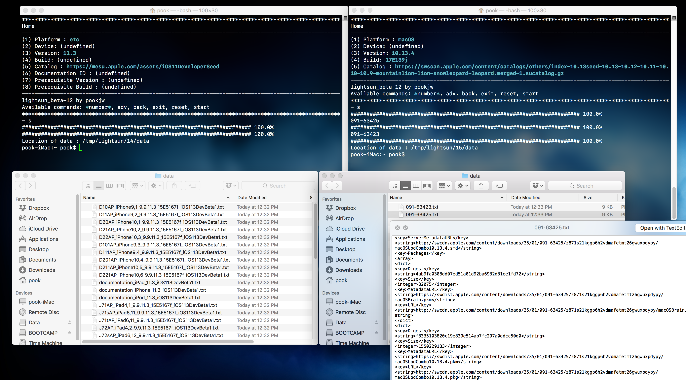

# lightsun

This is still in beta...

## Features

- Parse Apple OS OTA catalog like macOS, iOS, watchOS, etc... 

- Detect catalog URL from seedutil (macOS) or .mobileconfig (iOS). It means you don't need to prepare URL text.

- (Coming Soon) command line options (ex: `./lightsun.sh -n iPhone10,4 -v 11.3 -c https://mesu.apple.com/assets/iOS11DeveloperSeed`)

- (Coming Soon) Extracting firmware
